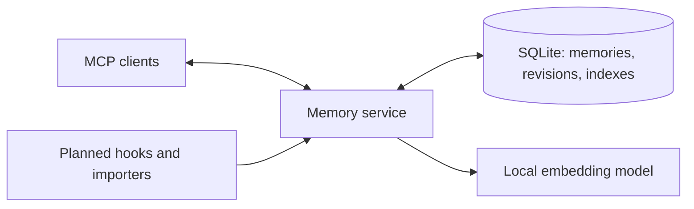

# Architecture and operating contract

## Goal

Provide one personal memory service for a Dot and other AI tools, with a small
maintainable implementation and agent-driven setup. The canonical store,
authentication, indexes, and embedding inference run on the user's host.

The owner-selected host is now `openclaw-appliance`, an owner-operated Linux
appliance. Dots Brain owns the bots' shared external memory; it is not limited to
a search projection over Agent Workspace. Required CORTEX connectors and the
initial contribution protocol are specified in the
[appliance contract](appliance-contract.md). This is the selected target, not an
assertion of deployed integration.

## Data flow

Source identity includes the provider, account, and source event identifier.
Identical retries must not duplicate memories. Conflicting versions must not
silently replace history. Source text and provenance are authoritative; search
indexes are derived. Forgetting removes text and derived representations and
retains a minimal suppression record to prevent accidental reimport.
Deletion compares the caller's observed revision inside the same write transaction
as removal. A concurrent update requires the caller to review the new revision
and deletion intent. Source metadata is client-declared; authenticated writer
attribution and project-scoped source identities remain planned.

Search combines full-text and local semantic retrieval. Results include source
references and revisions. Context is bounded; an entire archive does not belong
in every prompt. A missing model must be visible rather than silently replaced
by a paid API.

## Connectivity and trust

Use the official MCP SDK and test the negotiated protocol. A single public
HTTPS endpoint can serve authorized clients. Stdio support is a local transport,
not a tunnel or a separate memory product. Remote clients require an appropriate
authenticated transport. Each client has explicit capabilities and project scope.

Credential automation and credential isolation are different guarantees. A future
credential broker must have a real OS or platform boundary before claiming that
agents cannot read secrets. User authorization and supported account login are
still required to establish external credentials.

## Installation

Ship a tested, versioned package, not generated application code at each install.
Detect the environment, reuse existing state, configure supported integrations,
verify actual reads and writes, and report any missing capability. Installation
must resume after an unavoidable login or device permission. Capture and history
imports have separate status from MCP access.

## Native ChatGPT capabilities

Plugin Extensions can provide navigation, a conversation panel, settings, selected
model context, and an onboarding skill. MCP Events can send changes from the
server to ChatGPT to trigger user-requested automations. Neither feature provides
universal conversation history access. Event delivery must tolerate duplicates,
reordering, retries, expired subscriptions, and loops.

Native client features are optional clients of the appliance-hosted service.
Installing a client plugin does not move the canonical store to that client's VM
or to a separate hosting product.

## Evidence and open conditions

The implementation is supported by local and CI evidence. The selected appliance's
Dots Brain deployment still needs process supervision, restart, backup/restore,
model capacity, ingress, credential isolation, and actual client evidence.
Backups on the same disk do not protect against losing the appliance. Historical
Dot VM evidence remains in the [deployment record](vm-deployment.md).

- [MCP specification](https://modelcontextprotocol.io/specification/latest)
- [OpenAI Plugin Extensions](https://developers.openai.com/plugins/build/extensions)
- [OpenAI MCP Events](https://developers.openai.com/plugins/build/mcp-events)
- [OpenAI MCP Extensions specification](https://github.com/openai/mcp-extensions/blob/main/docs/spec.md)
